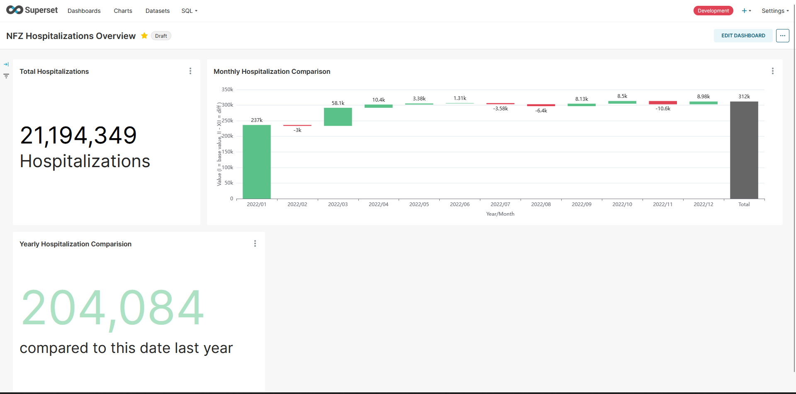

# Analyzing 21,194,349 Hospitalization Records from Poland's National Health Fund (NFZ)
**Comprehensive  ETL, Data Warehousing, Processing & Visualization Project**

 _A Low-Level Approach with SQL, Shell Scripts, SQLLoader and Apache Superset_

```keywords
#batch #dwh #datamart #nfz #data #etl #bi #visualisation #healthcare #dataengineering
#analyst #pipeline #dataops #batch #shell #oracle #apachesuperset #sqlcl #docker #pluggabledb
```

**Projects status:** *in progress*

---


## Sneak Peek
Let's start with a quick preview to grab your attention. I've prepared comprehensive cross-sectional descriptions and installers (shell & SQL scripts) for various versions of my reports. Of course, you don't have to go through the installation process. For more details, simply scroll down. 

Here are two dashboard options that showcase the results of my process:

- [**BI Dashboard** - Modern Approach _(show more screenshots)_](_dashboard-preview/dashboard-superset.md) 
 
*Example 1: Apache Superset: BI Visualisation with application side processing (in progress!)*

- [**Command Line Report** - Classic Approach](_dashboard-preview/dashboard-as-text.md)
```sql
SQL> select total_hospitalization_in_dataset
  2*  from rpt_totalhosp;
  
TOTAL_HOSPITALIZATION_IN_DATASET
___________________________________
21,194,349
```

*Example 2: SQlCl: Show Report View as Text Output*

and more...

---
## Introduction
### Project Objectives
Develop a ETL pipeline and utilize BI tools to process and visualize over 21 million NFZ hospitalization records (2017-2022), with a emphasis on data processing framework.

### Key Components
- Environment Setup: Script to automate database and environment configuration
- ETL & DWH: Automated extraction, transformation, and loading of data into a star schema data mart
- Reports & Dashboards:
    - Data Profiling Dashboard (visualisation + text-based report)
    - Main Analytical Dashboard (visualisation + text-based report)

### Used data
This project is based on real NFZ data sourced from the open-data portal, dane.gov.pl.
The dataset comprises all hospitalizations covered by the NFZ (National Health Fund of Poland) in 2017-2022 *.

- [Dane dotyczące hospitalizacji rozliczonych JGP w latach 2019-2021 ](https://dane.gov.pl/pl/dataset/3009,dane-dotyczace-hospitalizacji-rozliczonych-jgp-w-l/resource/45162) (contains hospitalizations 2017, 2018)
- [Dane dotyczące hospitalizacji rozliczonych JGP w latach 2022 ](https://dane.gov.pl/pl/dataset/3009,dane-dotyczace-hospitalizacji-rozliczonych-jgp-w-l/resource/54046)

The dataset comprises over 20 million records, with each record representing an individual patient's hospitalization data.

It's based on the public goverment repositories hub named data.gov.pl.

- [Source Licence](https://creativecommons.org/publicdomain/zero/1.0/legalcode.pl)

Used repository is not bad quality, but I saw small differences between files. I want to make some improvements, create DWH star schema, materialized view as fact table, dimensions etc...
I will clean and process the data to visualize it with Apache Superset.


## Tech stack 
This repository showcases my Data Engineering project, highlighting my diverse data-related skills. 
It includes database administration, data warehousing, and ETL development tasks.
My objective is to prepare and process this data for visualization purposes, including the creation of charts and dashboards. I aim to learn modern data visualization BI tool.

| Tool/Software           | Description                           |
|-------------------------|---------------------------------------|
| **Visualization**       |                                       |
| Apache Superset        | Visualization tool                    |
| **Data Cleaning**       |                                       |
| Oracle SQL             | Data cleaning and manipulation        |
| **Virtual Machines**    |                                       |
| VM 1                    | Oracle Linux with DB 21               |
| VM 2                    | Centos, Docker, Apache Superset container with cx_oracle connector |
| **Shell Scripting**     |                                       |
| MINGW Bash              | Shell scripting                       |
| **Data Loading**        |                                       |
| SqlLoader               | Data loading                          |
| **IDE**                 |                                       |
| SQLDeveloper 23         | IDE for DBA tasks and queries         |
| Visual Studio Code      | IDE with new Oracle plugin            |
| **Database Tools**      |                                       |
| SQLPlus & SQLCli        | Database command-line interface      |
| **Others**              |                                       |
| PlantUml                | Tool for diagrams                     |
| GIT                     | Version control system                |
 
## Data source
### NFZ source Data preview (CSV)
ROK;MIESIAC;OW_NFZ;NIP_PODMIOTU;KOD_PRODUKTU_KONTRAKTOWEGO;KOD_PRODUKTU_JEDNOSTKOWEGO;KOD_TRYBU_PRZYJECIA;KOD_TRYBU_WYPISU;PLEC_PACJENTA;GRUPA_WIEKOWA_PACJENTA;PRZEDZIAL_DLUGOSCI_TRWANIA_HOSPITALIZACJI;LICZBA_HOSPITALIZACJI
2022;4;"07";"1132866688";"03.4580.991.02";"5.51.01.0008013";6;2;"K";"65 i wiecej";"6 i wie™cej dni";"<5"
2022;8;"02";"5562239217";"03.4220.030.02";"5.51.01.0001087";3;2;"K";"45-64";"6 i wiecej dni";"<5"
2022;11;"03";"9462146139";"03.4580.991.02";"5.51.01.0008015";6;2;"K";"65 i wiecej";"6 i wiecej dni";"<5"
2022;9;"15";"7842008454";"03.4450.040.02";"5.51.01.0012014";3;2;"K";"65 i wiecej";"0 dni";"<5"
### Domain dictionaries
The data contains some foreign keys pointing to static dictionaries:

**The dictionary source for Polish HL7 implementations includes**
- discharge modes https://www.cez.gov.pl/HL7POL-1.3.2/plcda-html-1.3.2/plcda-html/voc-2.16.840.1.113883.3.4424.13.11.36-2015-10-26T000000.html
- admision modes

## My DWH DB model
I had to transform the source file into a star schema model for that data mart...


*Figure 1: DWH Model*

### Database Objects & Names Explanation
As a DBA, I handle SQL scripts, database creation, structure definition, user management, and permissions.

- [Database Specifcation - list of objects](docs/database.md)

## Installation
I've prepared some bash and SQL scripts to create database, structures and objects and automate the installation process. You can use either install.sh or rebuild.sh to get started.

- [Installation Manual](docs/install.md)


*Figure 1: Demonstration of the script execution process (gif animations)*

## Dashboard & Reports Results
Of course you don't have to go through the installation process. Simply open the text-based dashboard or view the visualization screenshots. However, if you're a professional user, you can review my analysis queries (along with all other scripts) by navigating to the sql/ GitHub directory.

- [View the text-based dashboard](_dashboard-preview/dashboard-as-text.md)
- [View the Apache Superset dashboard](_dashboard-preview/dashboard-superset.md)
- [Review my data profiling in sql/5-data-profiling.sql](sql/5-data-profiling.sql)
- [Review my queries in sql/6-create-reports-as-analyst.sql](sql/5-create-reports-as-analyst.sql)

---
